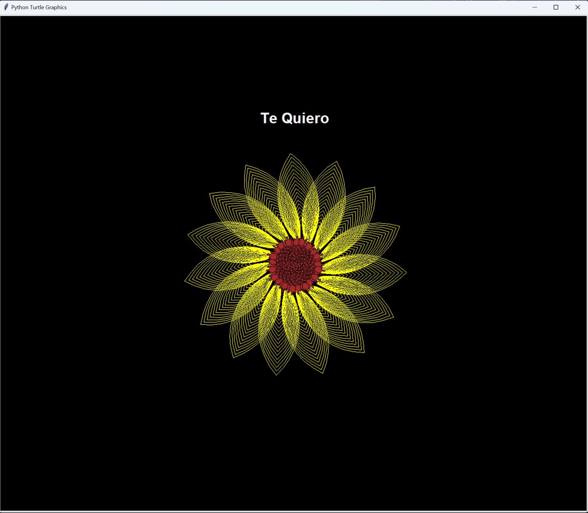
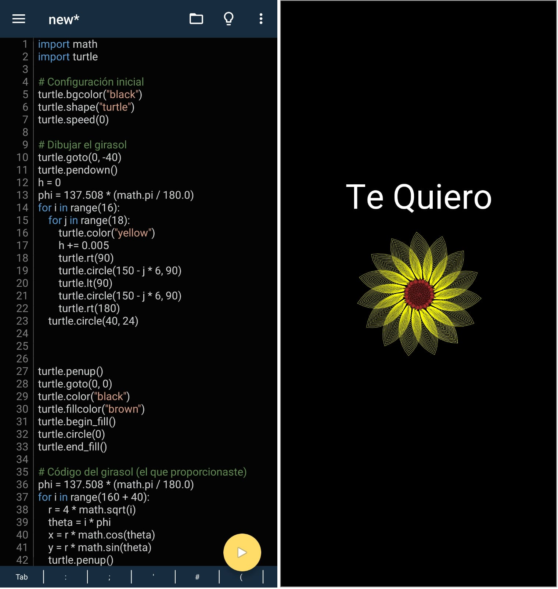

# Proyecto Girasol

**Proyecto Girasol** es una aplicación que te permite dibujar un hermoso girasol utilizando la biblioteca Turtle en Python.

## Instalación

1. Clona el repositorio:

```bash
git clone https://github.com/leonxrdon/flor-amarilla.git
```

## Uso
Puedes ejecutar el programa principal de dos maneras:

### En tu computadora
Ejecuta el programa principal con:
```bash
python main.py
```


### En Android con "Pydroid 3"
Si prefieres ejecutarlo en tu dispositivo Android, puedes hacerlo con la ayuda de la aplicación "Pydroid 3". Sigue estos pasos:

- Abre la aplicación "Pydroid 3".
- Pega el código en un nuevo proyecto.
- Ejecuta el programa.





---
¡Espero que esta aplicación te ayude a entender cómo usar la biblioteca Turtle y te permita dedicar una hermosa flor amarilla a alguien especial!